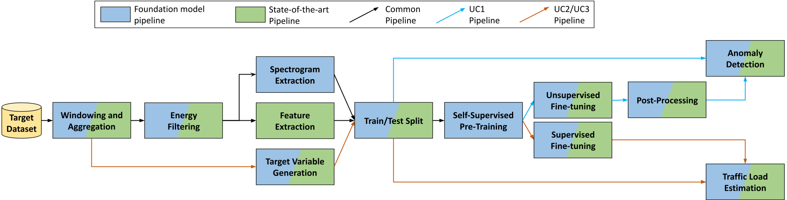
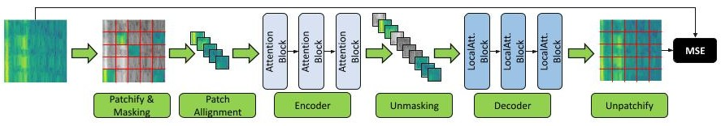

# Foundation Models for Structural Health Monitoring
This is the repository for the paper "Foundation Models for Structural Health Monitoring", which has been submitted on March 29th, 2024 and is currently under review. The ArXiv paper can be found [here](link)

## Abstract
Structural Health Monitoring (SHM) is a critical task for ensuring the safety and reliability of civil infrastructures, typically realized on bridges and viaducts by means of vibration monitoring.
In this paper, we propose for the first time the use of Transformer neural networks, with a Masked Auto-Encoder architecture, as *Foundation Models* for SHM. We demonstrate the ability of these models to learn generalizable representations from multiple large datasets through self-supervised pre-training, which, coupled with task-specific fine-tuning, allows them to outperform state-of-the-art traditional methods on diverse tasks, including Anomaly Detection (AD) and Traffic Load Estimation (TLE). We then extensively explore model size versus accuracy trade-offs and experiment with Knowledge Distillation (KD) to improve the performance of smaller Transformers, enabling their embedding directly into the SHM edge nodes. We showcase the effectiveness of our foundation models using data from three operational viaducts. For AD, we achieve a near-perfect 99.9\% accuracy with a monitoring time span of just 15 windows. In contrast, a state-of-the-art method based on Principal Component Analysis (PCA) obtains its first good result (95.03\% accuracy), only considering 120 windows. On two different TLE tasks, our models obtain state-of-the-art performance on multiple evaluation metrics (R2 score, MAE\% and MSE\%). On the first benchmark, we achieve an R2 score of 0.97 and 0.85 for light and heavy vehicle traffic, respectively, while the best previous approach stops at 0.91 and 0.84. On the second one, we achieve an R2 score of 0.54 versus the 0.10 of the best existing method

## Summary 
Here you can see an overview of our processing pipeline for AD and TLE tasks. In blue are the blocks for our foundation model pipeline, and in green are the ones for SoA algorithms. Both colours are used for shared blocks. 


Our base architecture of our transformer-based masked autoencoder used during pre-training and during the fine-tuning on UC1 is the following. On UC2 and UC3 the Decoder is replace with 2 fully connected layers as regression tails. Have a look a the paper for better understanding.


For a full overview of the obtained results, refer to the [paper](link).

## Setup
You can create your own python environment with: 
```
python3 -m venv --system-site-packages ./pyenv
```

Then, install the required packages with:
```
source ./pyenv/bin/activate
pip install -r requirements.txt
```
## Repository organization
### Datasets
The `Datasets` folder contains the DataLoader for the three downstream datasets: 
- `AnomalyDetection_SS335` for UC1 (AD)
- `Vehicles_Roccaprebalza` for UC2 (TLE)
- `Vehicles_Sacerties` for UC3 (TLE)
Data used to train and test our approach cannot be open-source as it is property of our commercial partner, Sacertis Ingegneria Srl.

### Algorithms
The `Algorithm` folder contains all the definition of the model used: 
- `models_audio_mae.py` defines the family of models used during pre-training and the AD fine-tuning task, while `models_audio_mae_evalutate.py` defines the model used during testing on the AD task (UC1)
- `models_audio_mae_regression.py` defines the family of models during the TLE fine-tuning tasks, UC2 and UC3.

In short, we build a Transformer-based Masked Autoencoder inspired by [this](https://arxiv.org/abs/2207.06405), replacing the decoder with a regression tail for the two TLE taks (UC2 and UC3).

### Other info
- in `model_exploration.py` we carry out a model size exploration based on the mean absolute reconstruction error on the training set.
- in `pretrain_all_datasets.py`  we pre-train our transformer-based masked autoencoder considering all three datasets.
- in `uc1.py`, `uc2.py` and `uc3.py`, starting from either the pre-trained model or a randomly intialized one, we fine-tune three models, one for each downstream datasets. 
- in `kd_uc1.py`, `kd_uc2.py` and `kd_uc3.py`, starting from the pre-trained models on all three datasets, we fine-tune models consider the knowledge distillation setup explained in the paper.
- two distinct plot files (`plot_uc1.ipynb` and `plot_uc2-3.ipynb`) to reproduce all the graphs presented in the paper.

### Checkpoints
Fine-tuned model weights for the three tasks, UC1, UC2 and UC3 are available at the following [link](https://drive.google.com/drive/folders/15sT3LZ8MLAe8Obt5V2kbT2-3VtSs3_Kq?usp=drive_link).

## Cite as
```
@misc{eval-harness,
  author       = {Benfenati, Luca and Jahier Pagliari, Daniele and Zanatta, Luca and Bedoya Velez, Yhorman Alexander and Acquaviva, Andrea and Poncino, Massimo and Macii, Enrico and Benini, Luca and Burrello, Alessio},
  title        = {Foundation Models for Structural Health Monitoring},
  url          = {...}
}
```
