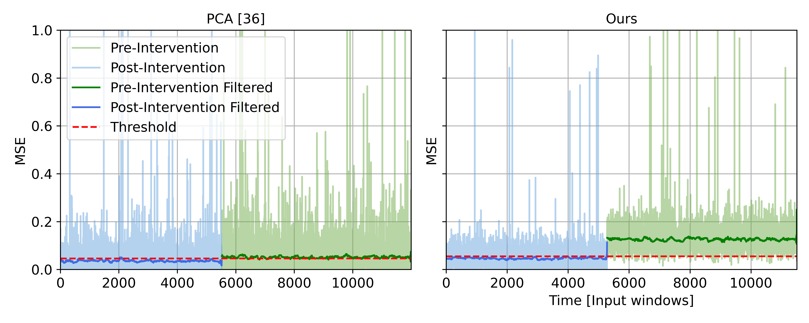

# Foundation Model for Structural Health Monitoring - Reconstruction MSE Plot

| # | Field Name               | Data                             |
|---|--------------------------|----------------------------------|
| 1 | Arxiv URL                | https://arxiv.org/abs/2404.02944 |
| 2 | Visualisation Image      |  |
| 3 | Visualisation Caption    | Reconstruction error of the PCA-based method and our proposed model, for normal and anomalous windows |
| 4 | Plotting Data            | [4_data](./4_data) (attached in this folder)|
| 5 | Code                     | [5_code.py](./5_code.py) (attached in this folder)         |
| 6 | Command                  | `python 5_code.py`           |
| 7 | Natural Language Request | Using the reconstruction error data in the '4_data' folder (PCA and 'ours' models for normal and anomaly samples), create a side-by-side comparison plot with two panels. For each model, plot the MSE values for pre-intervention (anomaly) and post-intervention (normal) data, showing both raw values (with alpha=0.5) and filtered values (using a median filter with window size 120). Use green and blue colors for the filtered lines, and light green and light blue for raw data. Add a red dashed line to indicate the threshold for anomaly detection. Include a grid on both axes, set y-axis limits from 0 to 1, and use the same y-scale for both panels. Label the x-axis as 'Time [Input windows]' and y-axis as 'MSE'. Add titles 'PCA [36]' and 'Ours' to the respective panels, and include a legend in the upper left corner. Save the figure as 'ad_reconstruction_MSE.png' with 600 DPI resolution.|

*This folder has been created in order for the research study "VisReflect: a new benchmark dataset for Text-to-Vis reflecting real-world practice".*